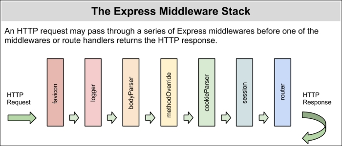

# Express.js szerver

## Általános projekt inicializálás
```bash
npm install -g typescript ts-node ts-node-dev
mkdir backend && cd backend
npm init
tsc --init
npm install express --save
npm install @types/node @types/express --save-dev
```

### Szerver indítása
``ts-node-dev index.ts``

### Express middleware-ek
<br>
_(Forrás: [Hage Yaapa - Express Web Application Development](https://www.packtpub.com/product/express-web-application-development/9781849696548))_

## Backend létrehozása a meglévő Angular-projektben
1. TypeORM globális telepítése:
   ```bash
   npm install -g typeorm@0.2.45
   ```
2. Projekt függőségek telepítése:
   ```bash
   npm install express typeorm@0.2.45 reflect-metadata mysql --save
   npm install @types/node @types/express ts-node ts-node-dev --save-dev
   ```
3. Backend inicializálása:
   ```bash
   mkdir backend
   cd backend
   typeorm init --database mysql
   ```

