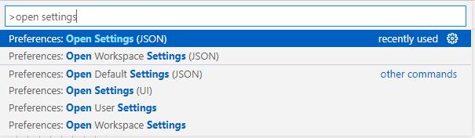
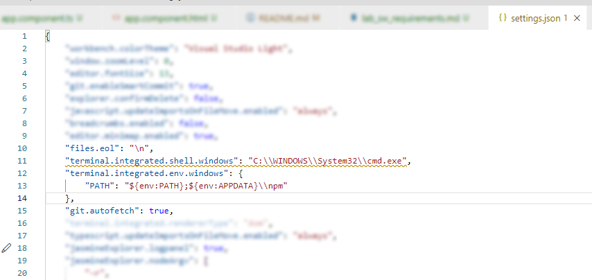

# Labor gépeken szükséges beállítások

1. Angular v12.2.6 telepítése, parancssorban: `npm install -g @angular/cli@12.2.16`

2. Visual Studio Code beállítása:
    - A VSCode megnyitása után nyomjuk le a `Ctrl+Shift+P` billentyűkombinációt, az ablak tetején megjelenik az ún. „Command Palette”.
    
    - Gépeljük be az `open settings` keresőszót, majd válasszuk a „Preferences: Open Settings (JSON)” lehetőséget.
    
    
    - Az így megnyitott JSON objektum egy tetszőleges pontjára másoljuk be az alábbiakat, majd mentsük el a fájlt:
        ```json
        "terminal.integrated.shell.windows": "C:\\WINDOWS\\System32\\cmd.exe",
        "terminal.integrated.env.windows": {
            "PATH": "${env:PATH};${env:APPDATA}\\npm"
        },
        ```
        

    - Az ablak tetején látható „Terminal” menüben válasszuk a „New Terminal” lehetőséget, majd futtassuk az alábbi parancsot, ellenőrizve a beállítás sikerességét:
        ```
        ng --version
        ```
