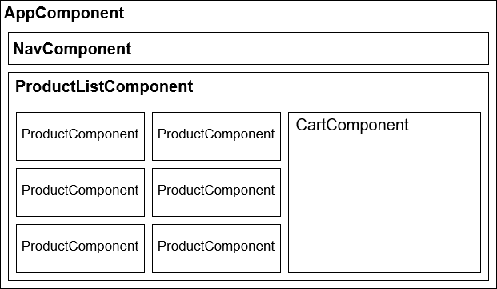
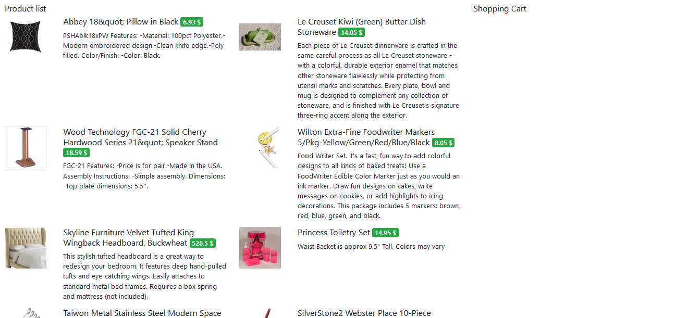

# Webshop
Webshop alkalmazás terve.

## Komponens terv
- `AppComponent`: Megjeleníti a menüt és az aktuális lapot (központi navigációs komponens).
- `NavComponent`: Megjeleníti a menürendszert.
- `ProductListComponent`: Betölti a termékeket, és megjeleníti azokat. Megjeleníti a kosár tartalmát is.
- `ProductComponent`: Megjeleníti egy bemeneti paraméterként kapott termék adatait (a [termékadatbázis](products-database.md) és a lenti screenshot alapján).

## Minta screenshot

